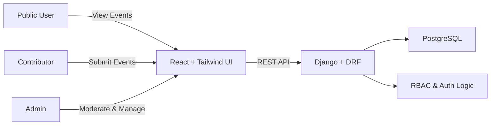
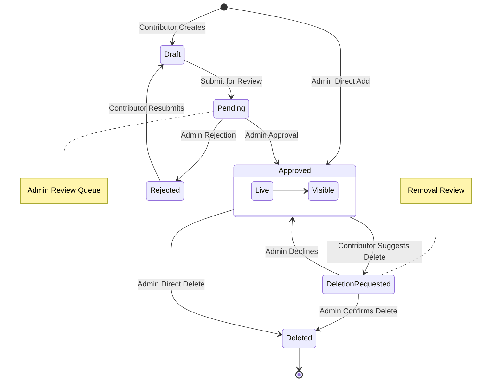
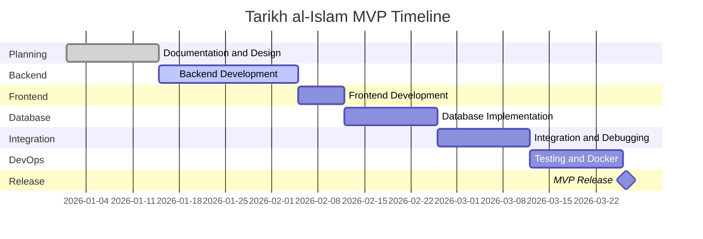

  

<h1 align="center">
  Tārīkh al-Islām
  
</h1>

  
  
  
  
  

> [!WARNING]
> This project is under development.  
> **Estimated release:** May 2026

---

## What this project actually is

**Tārīkh al-Islām** is a **Temporal–Geospatial Knowledge Platform** focused on Islamic history.

Instead of reading long articles, users **explore history visually** through:

- 📅 Interactive timeline  
- 🗺️ (Future) Map-based exploration  
- 📖 Sequential historical events  

The goal is to **see Islamic history**, not just read it.

## Why this project is different

Most Islamic history platforms are:

- Text-heavy  
- Blog-style  
- Fragmented  
- Static  
- Difficult to understand chronologically  

### This project changes the model

| Traditional Platforms | Tārīkh al-Islām |
|----------------------|----------------|
| Article-based | Data-driven |
| Static text | Interactive visualization |
| Linear reading | Exploratory navigation |
| No spatial context | Map-based intelligence |
| No temporal engine | Timeline engine |

> This is a **historical visualization engine**.

## System at a Glance (High-Level Architecture)

## Core Workflow Overview
### Event Lifecycle

> [!NOTE]
> For more information, see the [Detailed Documentation](https://github.com/Irshad-11/Tarikh-al-Islam/blob/main/docs/).

## Technology Stack (MVP)

| Layer    | Technology                       |
| -------- | -------------------------------- |
| Frontend | React, Tailwind CSS              |
| Backend  | Django, Django REST Framework    |
| Database | PostgreSQL                       |
| Auth     | Role-Based Access Control (RBAC) |
| DevOps   | Docker                           |

## Estimated Development Timeline

## Sources

Historical data is referenced and cross-checked using publicly available resources:

* **Wikipedia**
* **Al-Islam.org**
* **MuslimHeritage.com**
* **Internet Archive (Islamic history texts)**
* **Qatar Digital Library**

> [!NOTE]
> Sources are used for reference and verification only.
> Data is curated manually.

## License

This project is released under the **MIT License**.

* Free to use and modify
* Attribution appreciated
* Source materials follow their respective licenses

## Developer

**Irshad Hossain**
Student, Software Engineering
University of Frontier Technology, Bangladesh

