

  
  
   

  <h1>System Architecture</h1>
  <h3><i>Tarikh al-Islam</i></h3>

  ---

**Author:** Irshad Hossain
**Organization:** University of Frontier Technology, Bangladesh.
**Date:** January 14, 2026
**Version:** 1.0.1

### Revision History

The following table tracks the development and modifications of this document in accordance with IEEE documentation standards.

| Date | Version | Description | Author |
| :--- | :--- | :--- | :--- |
| 2026-01-14 | 1.0.0 | Initial MVP Requirement Draft | Irshad |
| 2026-01-14 | 1.0.1 | Drafted section on event deletion | Irshad |

# 1. Introduction

## 1.1 Purpose

This document describes the high-level system architecture of **Tārīkh al-Islām**.
It defines the major system components, their responsibilities, and the interactions between them.

The purpose of this document is to provide a clear architectural overview for developers, reviewers, and academic evaluation.

# 2. Architectural Overview

## 2.1 Architectural Style

Tārīkh al-Islām follows a **client–server architecture** with a **decoupled frontend and backend**.

The system is designed using a **three-tier architecture**, consisting of:

* Presentation Layer
* Application Layer
* Data Layer

This architectural approach improves scalability, maintainability, and separation of concerns.

### High-Level Architecture Diagram
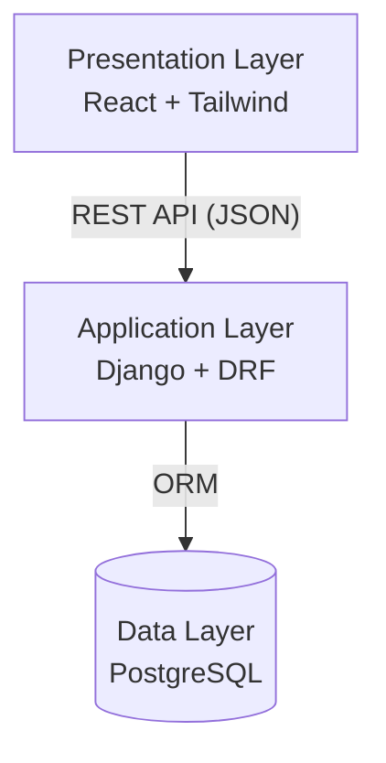

# 3. System Components

## 3.1 Presentation Layer (Frontend)

The Presentation Layer is responsible for user interaction and data visualization.

### Responsibilities

* Display historical events in timeline view
* Provide search and filtering interfaces
* Render event details and metadata
* Provide dashboards for Admin and Contributor roles
* Communicate with backend services via REST APIs

### Technology

* React
* Tailwind CSS

### Frontend Role-Based Views

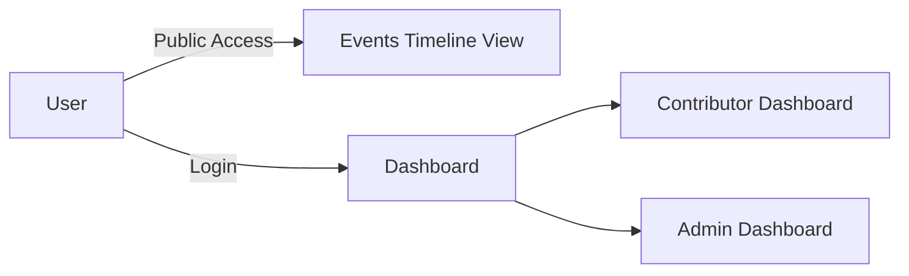

## 3.2 Application Layer (Backend)

The Application Layer contains the core business logic and access control mechanisms.

### Responsibilities

* Handle authentication and authorization
* Enforce role-based access control (RBAC)
* Process event creation, approval, and moderation
* Expose RESTful APIs to the frontend
* Validate and manage historical data

### Technology

* Django
* Django REST Framework (DRF)

### Backend Logical Modules

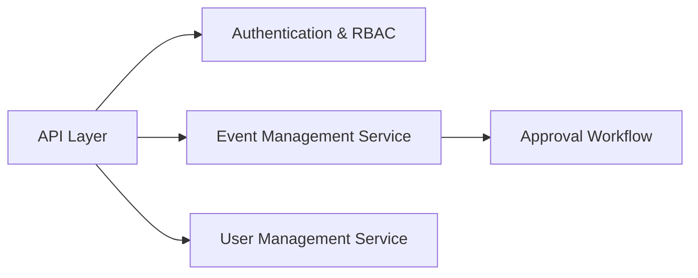

## 3.3 Data Layer (Database)

The Data Layer is responsible for persistent storage of system data.

### Responsibilities

* Store historical events and related metadata
* Store user accounts and role information
* Maintain data integrity and relationships
* Support future features such as spatial and temporal queries

### Technology

* PostgreSQL

### Core Database Entities (Conceptual)

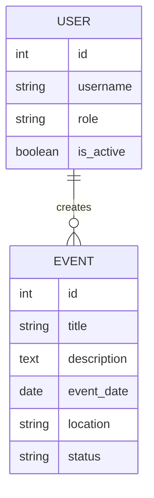

# 4. Component Interaction

## 4.1 Frontend–Backend Interaction

The frontend communicates with the backend using RESTful HTTP requests.
All data exchanged between the frontend and backend is in JSON format.

Authentication credentials are verified by the backend before granting access to protected resources.

### API Interaction Flow

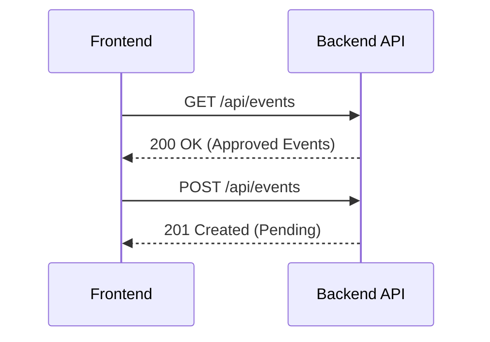

## 4.2 Backend–Database Interaction

The backend interacts with the database using an Object-Relational Mapping (ORM) layer.
This abstraction ensures secure and consistent data access while reducing direct dependency on database queries.

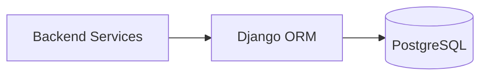

# 5. Data Flow Description

## 5.1 Event Retrieval Flow (Public User)

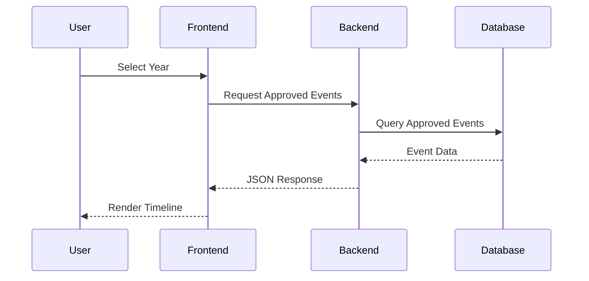

## 5.2 Event Submission Flow (Contributor)

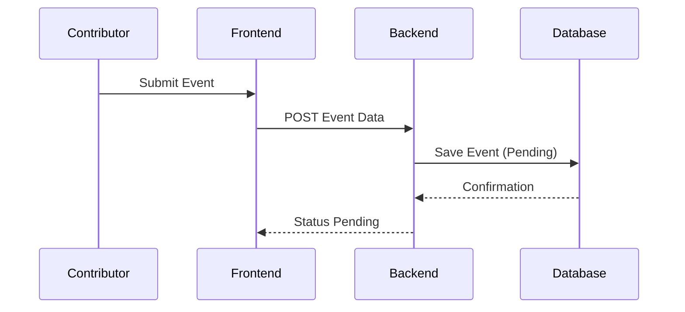

## 5.3 Event Approval Flow (Admin)

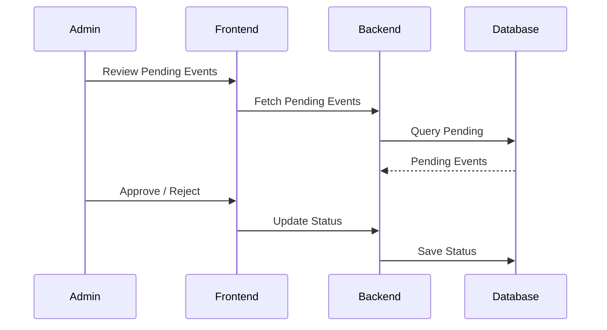

## 5.4 Event Deletion & Cleanup Flow (Admin)

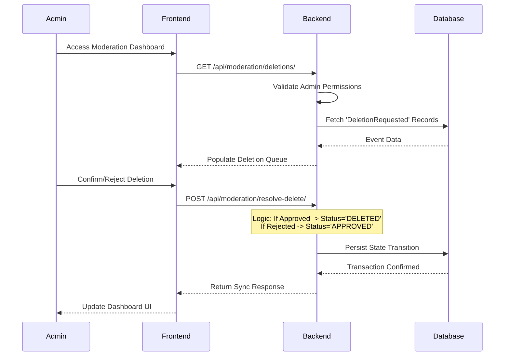

# 6. Deployment Architecture (High-Level)

The system is deployed using containerized services to ensure consistency across environments.

### Components

* Frontend container (React)
* Backend container (Django + DRF)
* Database container (PostgreSQL)

Docker is used to manage service orchestration and environment configuration.

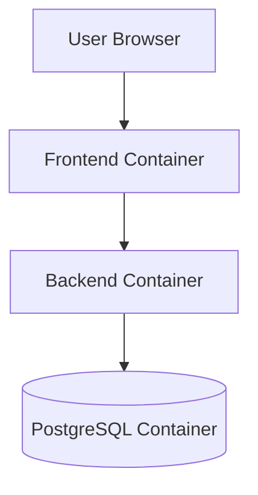

# 7. Design Considerations

## 7.1 Scalability

The decoupled architecture allows the frontend and backend to scale independently.

## 7.2 Maintainability

Modular component design enables easier updates and future enhancements, such as interactive map integration.

## 7.3 Security

All protected actions are enforced through backend authorization and role-based access control.

# 8. Architectural Constraints

* The system must use REST APIs for communication.
* The frontend and backend must remain decoupled.
* PostgreSQL must be used as the primary data store.
* Docker must be used for deployment consistency.

