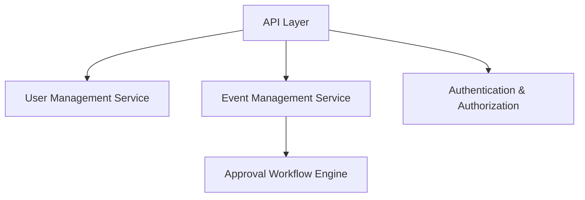
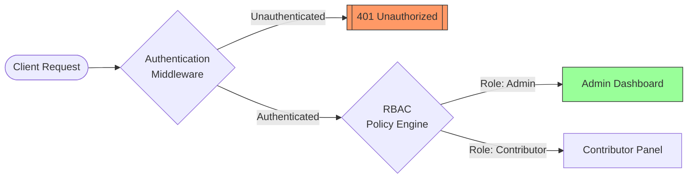
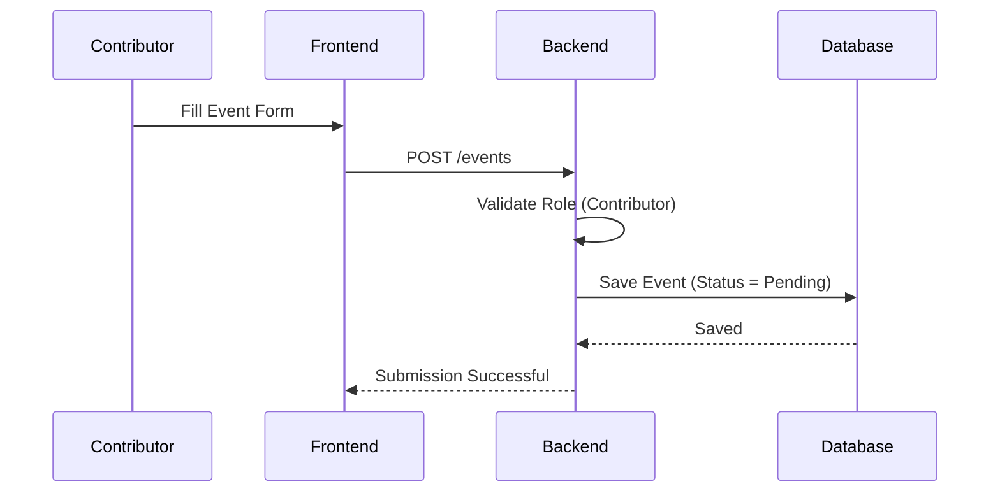
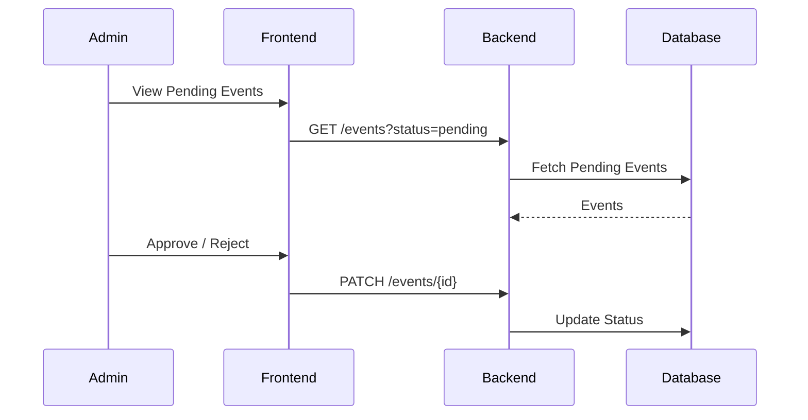
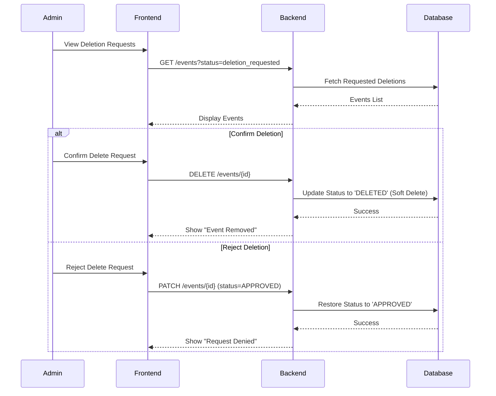
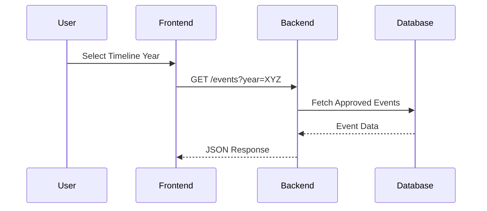
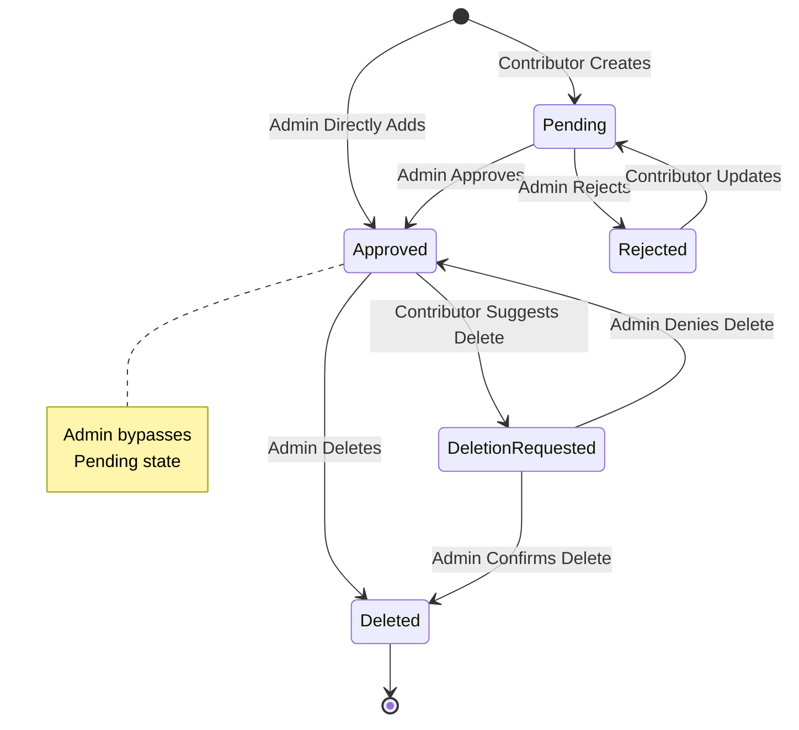
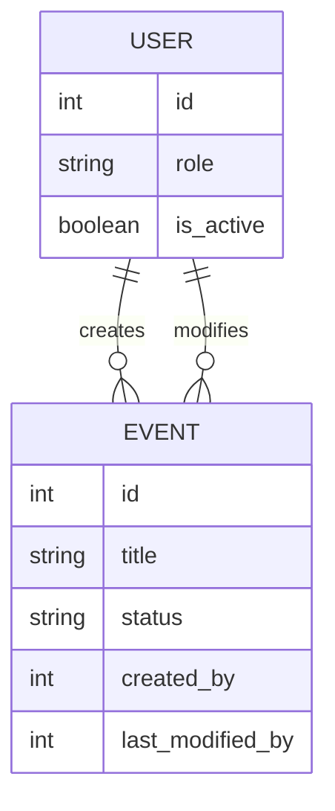

  
  
   

  <h1>System Design Document</h1>
  <h6><i>Low-Level System Design (LLD)</i></h6>
  <h3><i>Tarikh al-Islam</i></h3>

  ---

**Author:** Irshad Hossain
**Organization:** University of Frontier Technology, Bangladesh.
**Date:** January 14, 2026
**Version:** 1.0.0

### Revision History

The following table tracks the development and modifications of this document in accordance with IEEE documentation standards.

| Date | Version | Description | Author |
| :--- | :--- | :--- | :--- |
| 2026-01-14 | 1.0.0 | Initial MVP Requirement Draft | Irshad |

## 1. Introduction

### 1.1 Purpose

This document describes the **low-level system design** of the Tārīkh al-Islām platform.
It explains internal system behavior, workflows, module responsibilities, data handling, and role-based access logic.

This document complements the System Architecture and Software Requirements Specification (SRS).

## 2. Design Scope

The System Design covers:

* Internal module decomposition
* User and event lifecycle workflows
* Role-based access control logic
* API-level interaction behavior
* Data state transitions
* Error and validation handling (conceptual)

## 3. Module-Level Design

### 3.1 Backend Module Decomposition

The backend system is logically divided into the following modules (services):

### 3.2 User Management Module

**Responsibilities:**

* Contributor registration
* Authentication and login
* Role assignment (ADMIN / CONTRIBUTOR)
* Account activation and suspension
* Providing user metadata to other modules

**Key Design Decisions:**

* Public users do not require accounts
* Only contributors can register
* Admins are created manually or elevated

### 3.3 Event Management Module

**Responsibilities:**

* Event creation and modification
* Event lifecycle management
* Event approval and rejection
* Maintaining historical integrity of data

**Event States:**

* `PENDING`
* `APPROVED`
* `REJECTED`
* `DELETED`

## 4. Role-Based Access Control (RBAC) Design

### 4.1 Role Permission Matrix

| Action                   | Public | Contributor | Admin |
| ------------------------ | ------ | ----------- | ----- |
| View events              | ✔      | ✔           | ✔     |
| Create event             | ✖      | ✔           | ✔     |
| Delete event             | ✖      | ✖           | ✔     |
| Edit own event (pending) | ✖      | ✔           | ✔     |
| Approve / Reject event   | ✖      | ✖           | ✔     |
| Suspend contributor      | ✖      | ✖           | ✔     |

### 4.2 RBAC Enforcement Flow

## 5. Workflow Design

### 5.1 Event Submission Workflow (Contributor)

### 5.2 Event Approval Workflow (Admin)

### 5.3 Event Deletion Workflow (Admin)

### 5.4 Event Retrieval Workflow (Public User)

## 6. Event Lifecycle Design

## 7. Data Design (Logical Level)

### 7.1 Core Entities (Logical)

> [!NOTE]
> Detailed [Database Design](https://github.com/Irshad-11/Tarikh-al-Islam/blob/main/docs/04-database-design.md) is documented separately.

## 8. API Design Overview (Conceptual)

### 8.1 Event APIs

| Endpoint     | Method | Role               |
| ------------ | ------ | ------------------ |
| `/events`     | GET    | All                |
| `/events`      | POST   | Contributor, Admin |
| `/events/{id}` | PATCH  | Admin              |
| `/events/{id}` | DELETE | Admin              |

> [!NOTE]
> Detailed [API Design](https://github.com/Irshad-11/Tarikh-al-Islam/blob/main/docs/05-api-design.md) is documented separately.

## 9. Error Handling Design

* Unauthorized access returns `403 Forbidden`
* Invalid data returns `400 Bad Request`
* Suspended users are blocked at authorization level
* All validation errors are returned in structured JSON

## 10. Design Considerations

### 10.1 Extensibility

* Location data stored for future map integration
* Metadata fields allow audit and tracking

### 10.2 Maintainability

* Clear separation between user logic and event logic
* Modular Django apps

### 10.3 Security

* RBAC enforced at backend
* No client-side trust

## 11. Design Constraints

* Django REST Framework must be used for API logic
* PostgreSQL must store all persistent data
* Frontend must not directly access the database
* Dockerized deployment must be supported

## 12. Conclusion

This system design ensures clarity, modularity, and future scalability while maintaining simplicity for the MVP.
The design aligns with academic standards and real-world software engineering practices.

