

  
   
  <h1>Database Design</h1>
  <h3><i>Tārīkh al-Islām</i></h3>
  

**Author:** Irshad Hossain
**Organization:** University of Frontier Technology, Bangladesh
**Date:** January 14, 2026
**Version:** 1.0.0

### Revision History

| Date       | Version | Description                 | Author |
| ---------- | ------- | --------------------------- | ------ |
| 2026-01-14 | 1.0.0   | Initial MVP Database Design | Irshad |

## 1. Introduction

This document describes the **logical and physical database design** for the *Tārīkh al-Islām* platform.

The database is designed to:

* Preserve historical accuracy
* Support moderation workflows
* Enable future geospatial and temporal features
* Maintain full auditability of changes

## 2. Design Goals

* Data integrity and normalization
* Role-based data ownership
* Traceability of all content changes
* Support for future map and timeline engines
* Compliance with academic and real-world engineering standards

## 3. Core Entity Overview

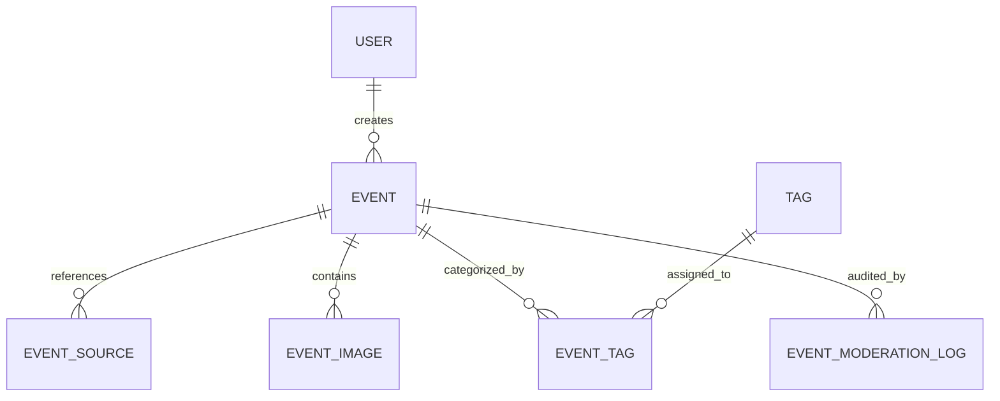

## 4. Table Definitions

### 4.1 users

Stores system users with role-based permissions.

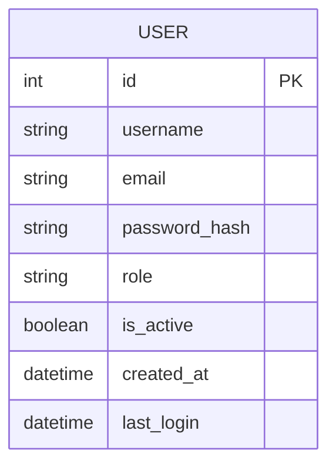

### 4.2 events

Stores historical events with temporal and spatial context.

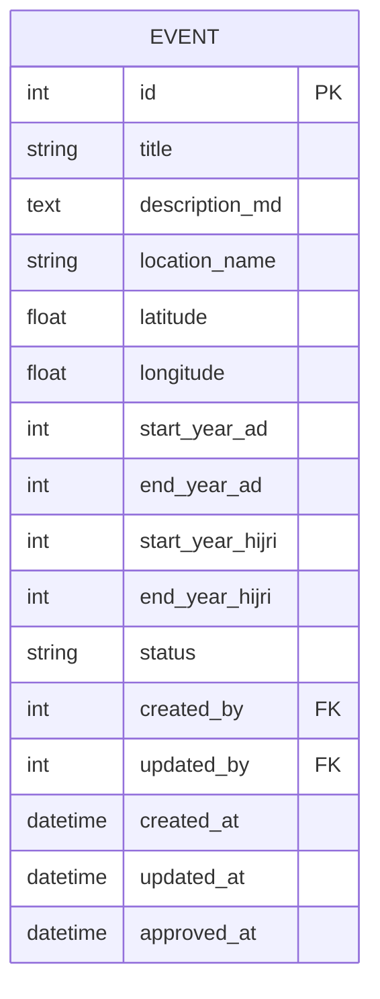

**Status Lifecycle:**

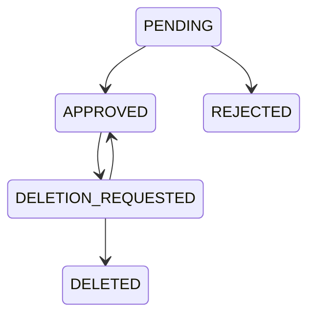

### 4.3 event_sources

Stores source references for verification.

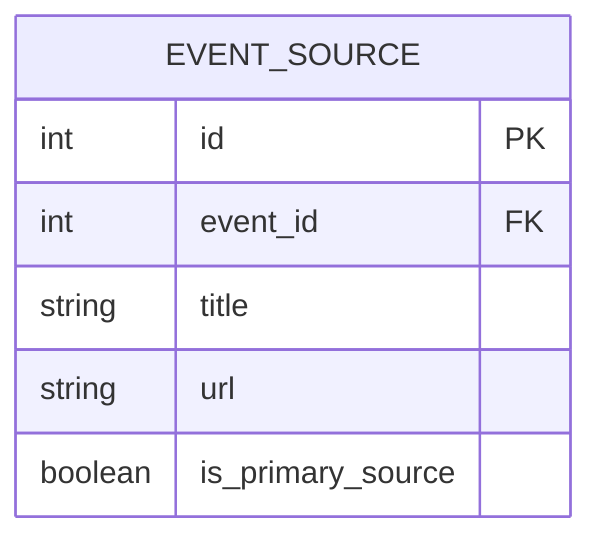

### 4.4 tags & event_tags

Supports flexible classification.

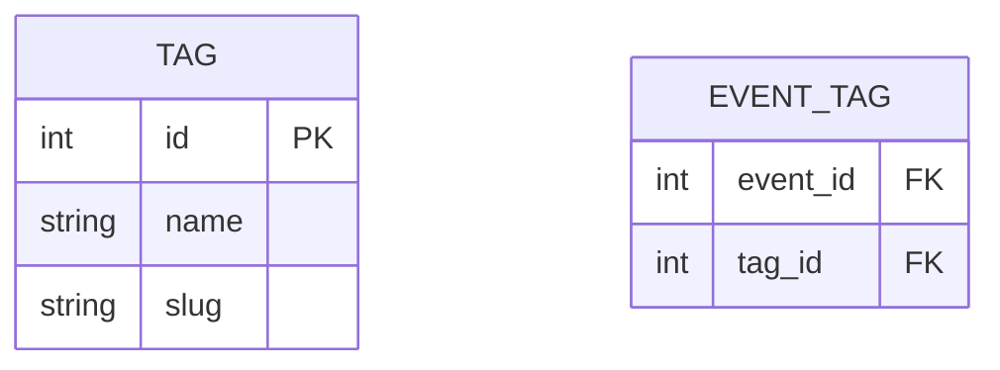

### 4.5 event_images

Stores visual media related to events.

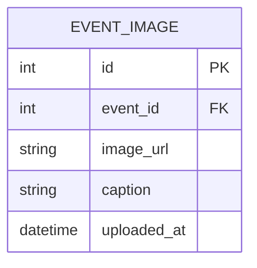

### 4.6 event_moderation_log

Provides a complete audit trail.

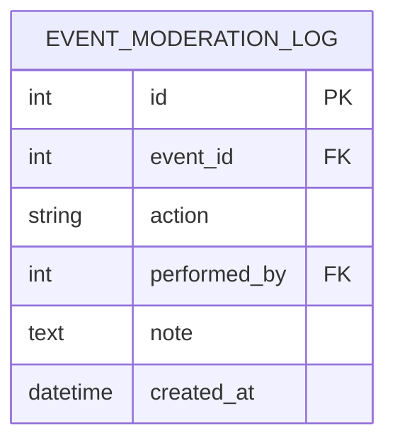

**Why this table is critical:**

* Academic integrity
* Transparency
* Debugging & review
* Real-world moderation modeling

## 5. Relationship Summary and Table Connectivity

This section explains how all database tables are **logically related and physically connected** within the Tārīkh al-Islām system.
The relationships are designed to reflect **real-world historical data curation**, where contributors submit content, administrators moderate it, and all actions remain traceable.

### 5.1 Relationship Overview (Descriptive)

* A **Contributor** can create multiple **historical events**, forming a one-to-many relationship between `users` and `events`.
* Each **event** may reference multiple **historical sources**, allowing academic verification and cross-referencing.
* Events can be associated with multiple **tags** (such as dynasty, region, or theme), implemented using a junction table to maintain normalization.
* Each event may include multiple **images** to support visual understanding.
* All moderation-related actions (approval, rejection, deletion requests) are recorded in a dedicated **moderation log**, ensuring transparency and accountability.
* Every moderation action is linked to the **Contributor or Admin** who performed it, maintaining a complete audit trail.

This structure ensures that **historical data remains authoritative, verifiable, and auditable**.

## 5.2 Logical Relationship Diagram (Conceptual)

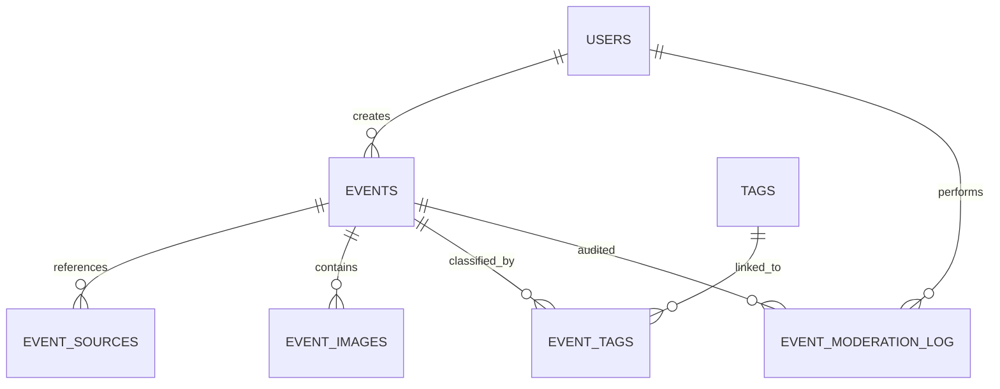

## 5.3 Physical Foreign Key Connectivity (Database View)

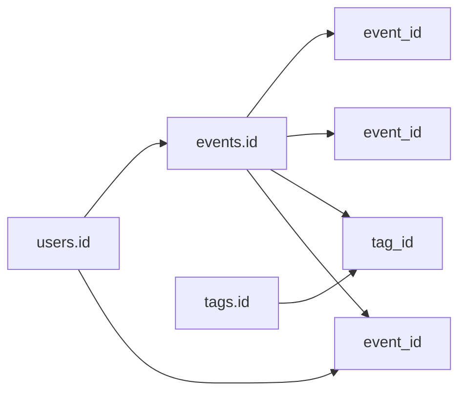

This diagram represents **actual foreign key relationships** as implemented in PostgreSQL.

# 6. Example Database Walkthrough
The following section demonstrates **how real data would look inside the database**, using concrete examples.

## 6.1 Example: Contributor Record

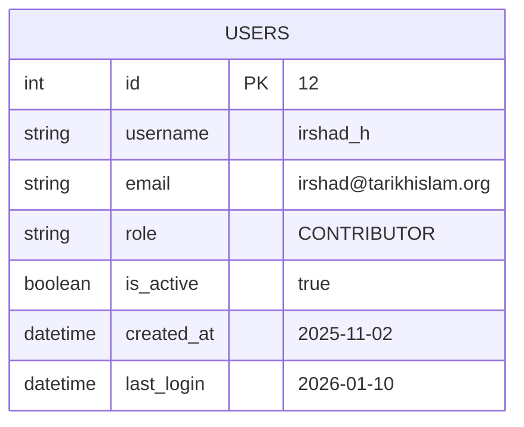

## 6.2 Example: Historical Event Record

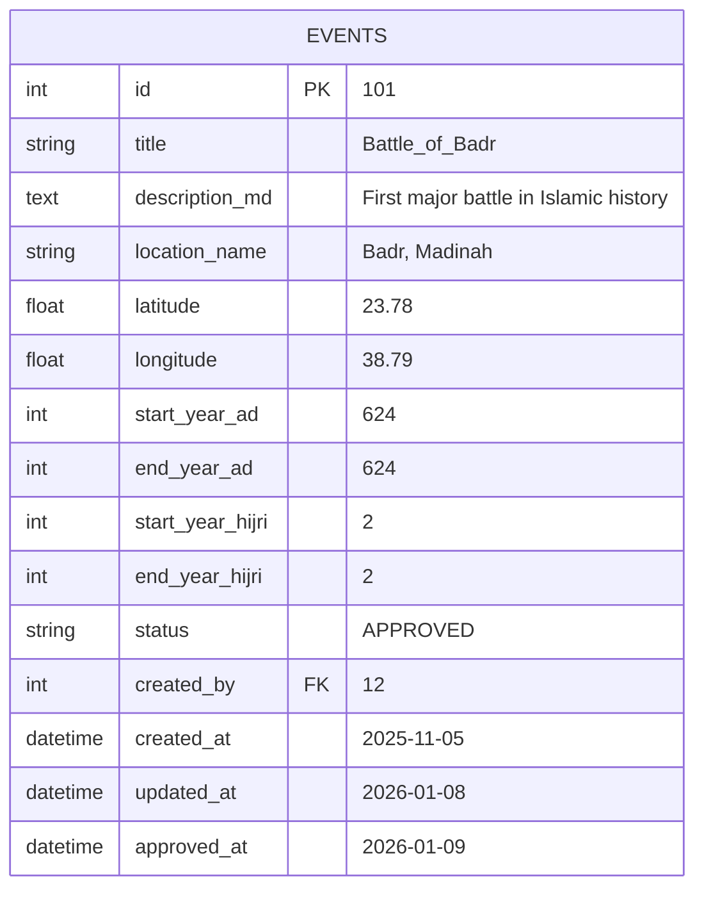

## 6.3 Example: Multiple Event Sources (Academic References)

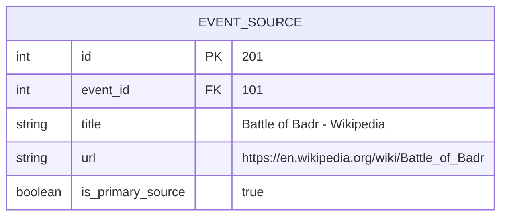

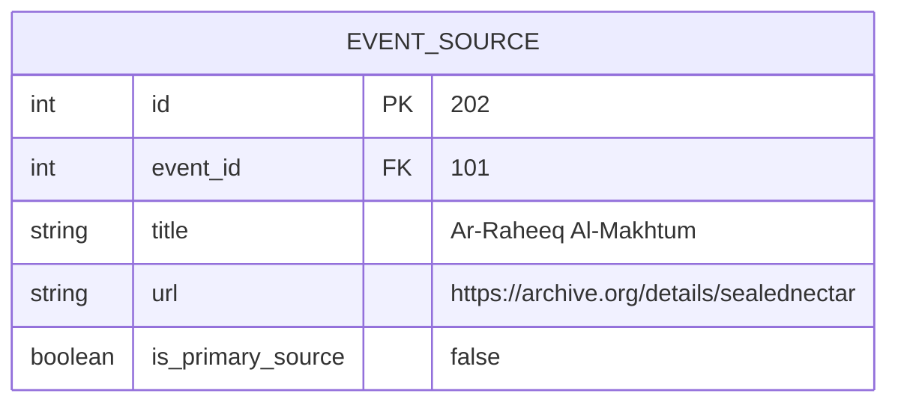

This shows how **multiple sources** can validate a single event.

## 6.4 Example: Tags and Event Classification

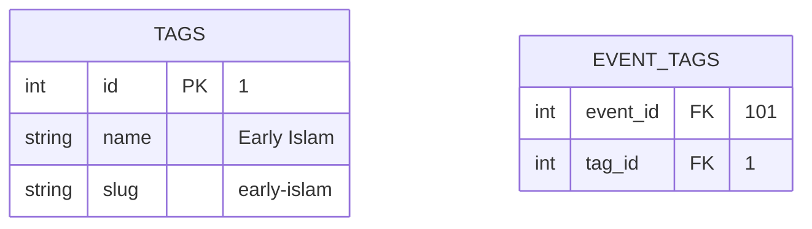

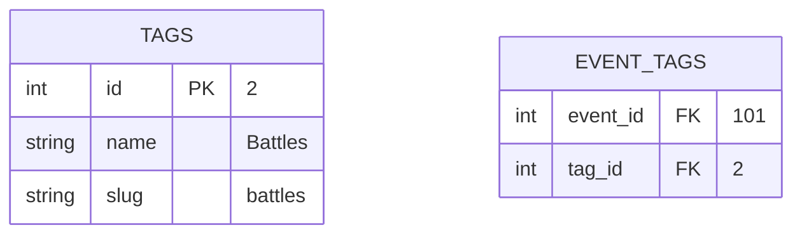

This allows **flexible filtering and thematic grouping**.

## 6.5 Example: Event Images

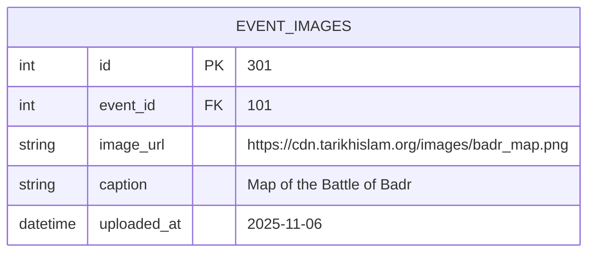

## 6.6 Example: Moderation Log (Audit Trail)

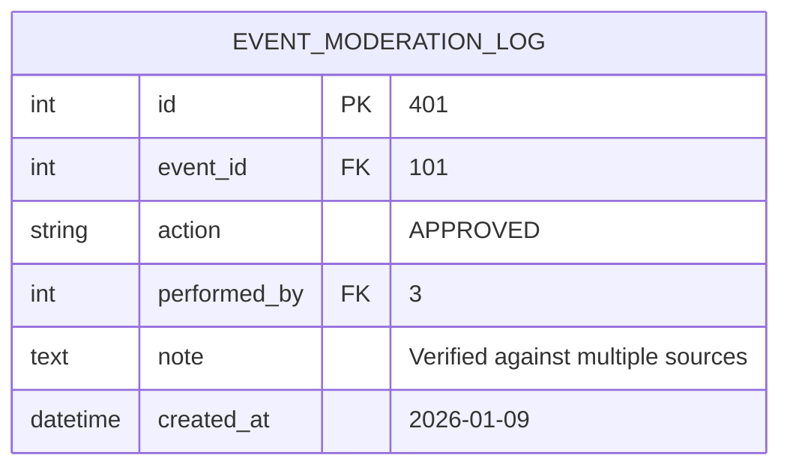
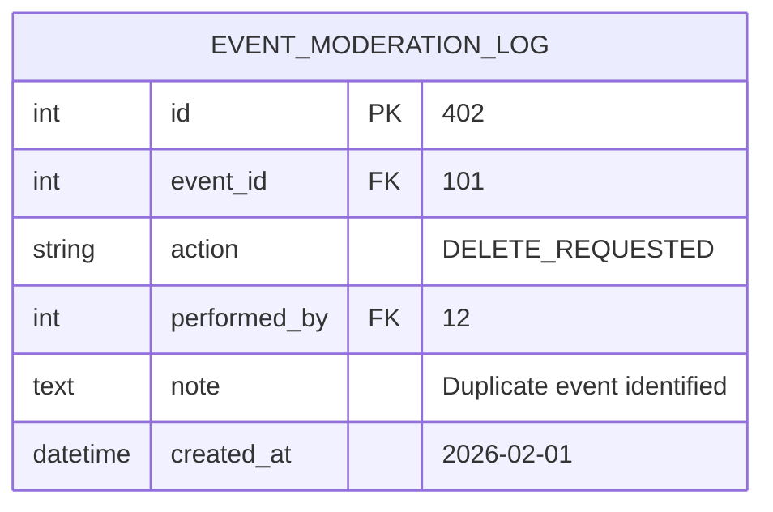

This ensures **every moderation action is permanently recorded**.

