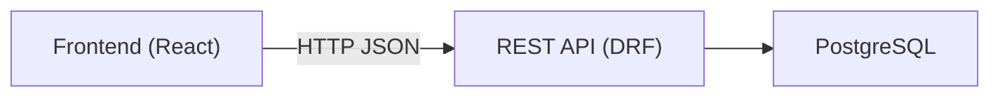
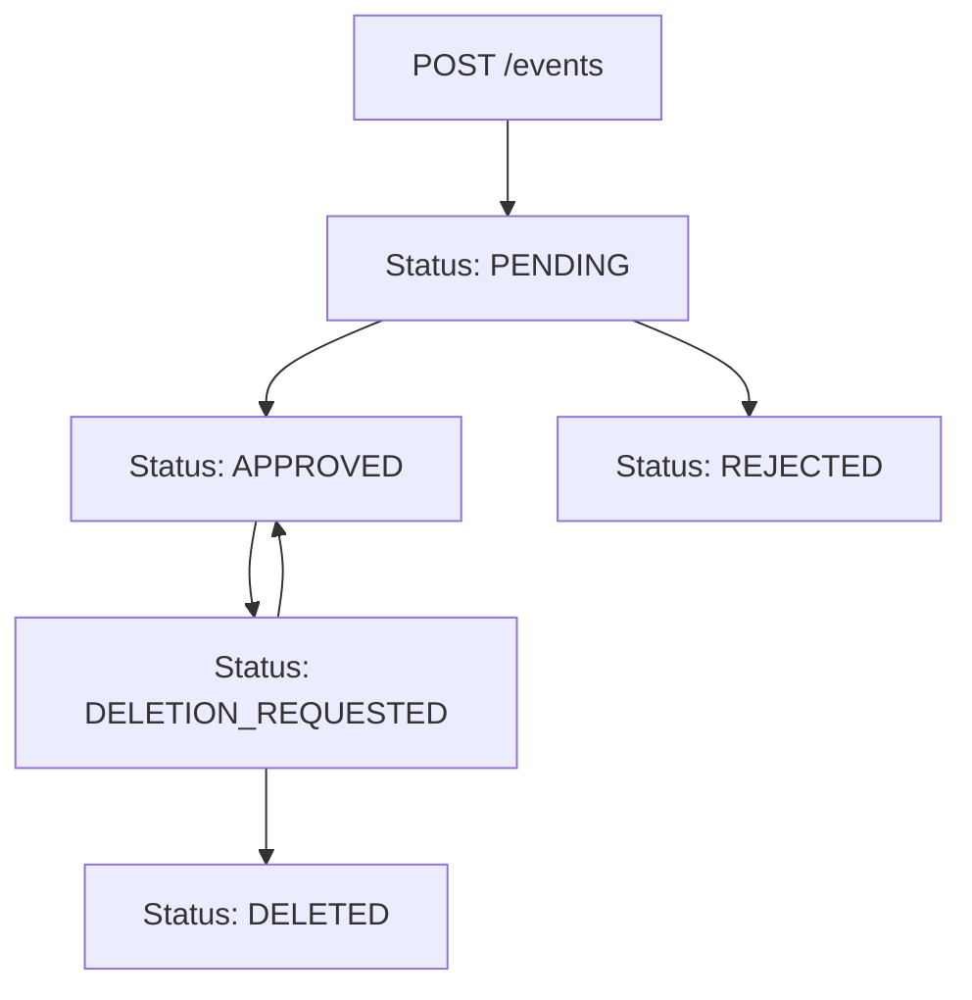

  
   
  <h1>API Design Document</h1>
  <h3><i>Tārīkh al-Islām</i></h3>
  

**Author:** Irshad Hossain  
**Organization:** University of Frontier Technology, Bangladesh  
**Date:** January 14, 2026  
**Version:** 1.0.0  

**API Style:** REST
**Backend:** Django + Django REST Framework (DRF)
**Data Format:** JSON
**Auth Model:** Session-based (JWT planned for future)

### Revision History

| Date       | Version | Description                 | Author |
| ---------- | ------- | --------------------------- | ------ |
| 2026-01-15 | 1.0.0   | Initial MVP Database Design | Irshad |

## 1. Purpose

This document defines the **API design** for *Tarikh al-Islam*.
It describes available endpoints, request/response formats, access control rules, and event lifecycle handling.

The API enables:

* Public exploration of historical events
* Contributor-driven event submission
* Admin-based moderation and approval

## 2. API Design Principles

The API follows these principles:

* RESTful resource-based URLs
* Stateless request handling
* Clear separation of roles
* Role-Based Access Control (RBAC)
* Predictable HTTP status codes

## 3. User Roles and API Access

| Role        | API Access                          |
| ----------- | ----------------------------------- |
| Public User | Read-only access to approved events |
| Contributor | Create and manage own events        |
| Admin       | Full access to all resources        |

## 4. High-Level API Architecture

## 5. Authentication APIs

### 5.1 Contributor Registration

**POST** `/api/auth/register/`

### 5.2 Login

**POST** `/api/auth/login/`

### 5.3 Logout

**POST** `/api/auth/logout/`

## 6. Event APIs

### 6.1 List Approved Events (Public)

**GET** `/api/events/`

**Access:** Public

**Query Params**

* `year`
* `tag`
* `search`

### 6.2 View Event Details

**GET** `/api/events/{id}/`

### 6.3 Create Event (Contributor)

**POST** `/api/events/`

**Access:** Contributor

**Behavior**

* Event is created with `PENDING` status

### 6.4 Update Own Event (Contributor)

**PUT** `/api/events/{id}/`

✔ Allowed only if:

* Contributor is creator
* Event is not yet approved

### 6.5 Request Event Deletion (Contributor)

**POST** `/api/events/{id}/request-deletion/`

**Result**

* Event status → `DELETION_REQUESTED`

## 7. Admin Moderation APIs

### 7.1 View Pending Events

**GET** `/api/admin/events/pending/`

### 7.2 Approve Event

**POST** `/api/admin/events/{id}/approve/`

### 7.3 Reject Event

**POST** `/api/admin/events/{id}/reject/`

### 7.4 Confirm Deletion

**POST** `/api/admin/events/{id}/delete/`

### 7.5 Manage Contributors

**POST** `/api/admin/contributors/{id}/suspend/`
**POST** `/api/admin/contributors/{id}/activate/`

## 8. Event Moderation Flow (API Perspective)

## 9. HTTP Status Codes

| Code | Meaning          |
| ---- | ---------------- |
| 200  | Success          |
| 201  | Resource created |
| 400  | Invalid input    |
| 401  | Unauthorized     |
| 403  | Forbidden        |
| 404  | Not found        |

## 10. Versioning Strategy

* Current version: `v1`
* Base URL: `/api/v1/`
* Future versions will not break existing clients

## 11. Future Enhancements

* JWT-based authentication
* Rate limiting
* Public read-only API
* GraphQL layer for analytics
