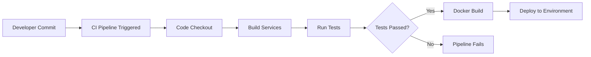
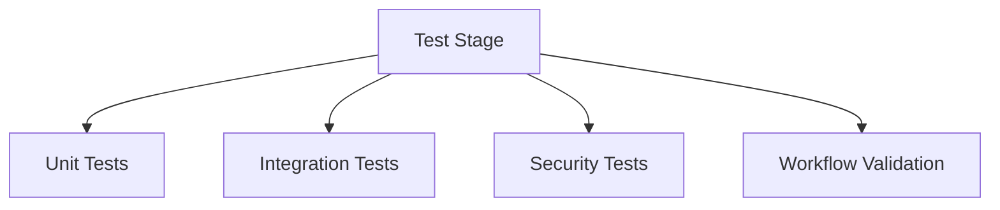
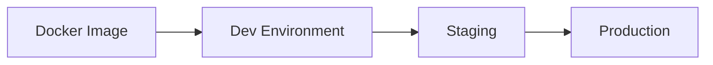
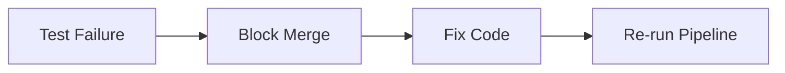

  
   
  <h1>CI/CD Workflow Specification</h1>
  <h3><i>Tārīkh al-Islām</i></h3>
  

**Author:** Irshad Hossain  
**Organization:** University of Frontier Technology, Bangladesh  
**Date:** January 15, 2026  
**Version:** 1.0.0  

### Revision History

| Date       | Version | Description                 | Author |
| ---------- | ------- | --------------------------- | ------ |
| 2026-01-15 | 1.0.0   | Initial MVP Database Design | Irshad |

## 1. Purpose

This document defines the **CI/CD workflow** for *Tarikh al-Islam* to ensure that:

* New code changes do not break existing functionality
* All tests are executed automatically on every change
* Code quality, security, and stability are maintained
* Deployment is predictable and repeatable

This workflow is designed for **academic evaluation** and **real-world software engineering standards**.

## 2. CI/CD Objectives

The CI/CD pipeline aims to:

* Automatically validate code on every commit
* Detect errors early through automated testing
* Enforce consistent build and deployment practices
* Reduce human error during integration and release

## 3. Workflow Triggers

The CI/CD pipeline is triggered on the following events:

* Push to `main` branch
* Push to `develop` branch
* Pull request creation or update
* Manual pipeline trigger (optional)

## 4. High-Level CI/CD Pipeline Overview

## 5. Pipeline Stages

### 5.1 Code Checkout

* The pipeline retrieves the latest source code from the repository.
* Ensures the pipeline always works with the most recent commit.

### 5.2 Build Stage

* Backend dependencies are installed.
* Frontend dependencies are installed.
* Docker configuration is validated.

**Purpose:**
To verify that the project builds successfully before testing.

### 5.3 Test Execution Stage

All automated tests are executed in this stage.

#### Test Categories:

* Unit tests
* Integration tests
* Workflow tests
* Role-based access tests

**Pipeline Rule:**
If **any test fails**, the pipeline stops immediately.

### 5.4 Quality and Validation Checks

This stage ensures:

* Database migrations are valid
* API contracts remain intact
* Role permissions are not violated

### 5.5 Docker Image Build

* Application services are containerized.
* Images are built using consistent environment settings.

**Purpose:**
To ensure the system runs identically across environments.

### 5.6 Deployment Stage

Deployment occurs only if:

* All tests pass
* The build is successful

Deployment environments:

* Development environment
* Staging environment (optional)
* Production environment (MVP release)

## 6. Test Coverage Enforcement

The CI pipeline enforces:

* Critical workflow coverage
* Role-based access validation
* Event lifecycle validation

### Mandatory Tested Workflows:

* Contributor event submission
* Admin event approval
* Event deletion request handling
* Public event retrieval

## 7. Failure Handling Strategy

If the pipeline fails:

* Deployment is blocked
* Error logs are generated
* Developers must fix issues before merging

## 8. Branch Protection Rules

To prevent unstable code:

* Direct pushes to `main` are restricted
* Pull requests require:

  * Successful CI run
  * Code review approval
* Failed pipelines cannot be merged

## 9. Security Considerations

The CI/CD pipeline ensures:

* Secrets are never stored in code
* Environment variables are managed securely
* Admin-only deployment permissions

## 10. Maintainability and Scalability

The workflow is designed to:

* Support future services (map engine, analytics)
* Allow parallel testing stages
* Scale with additional contributors

## 11. CI/CD Benefits for This Project

* Prevents system breakage after changes
* Encourages disciplined development
* Improves documentation trustworthiness
* Matches real-world engineering practices

